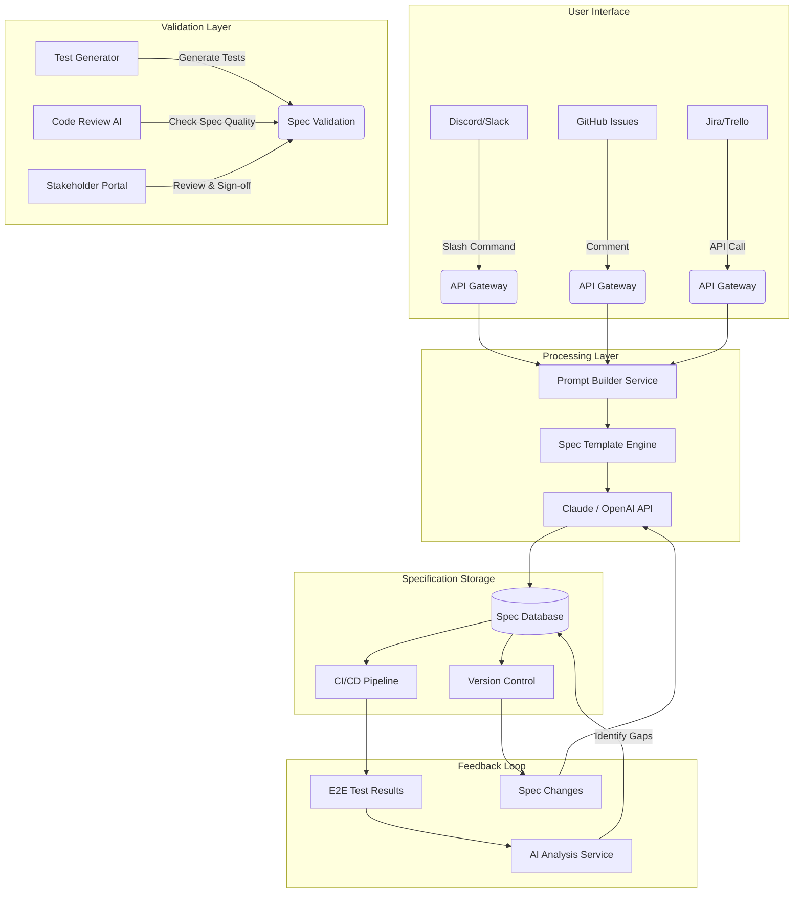

# Spec-Driven Development & Generative AI Integration
> **Version 2.0** — Expanded with AI Prompt Library, Team Roles & Responsibilities, and Tooling Recommendations

---

## Part 1: Defining Spec-Driven Development (SDD)

### What is SDD?

**Spec-Driven Development** is an iterative software development approach where **specifications are created first**, and then code is written to satisfy those specifications. Unlike traditional Agile practices that may write stories, tickets, or user stories before full specs, SDD emphasizes:

1. **Tests-first or acceptance criteria-first mindset**
2. **Code exists only when it satisfies a spec**
3. **Specs are living documents that evolve with the system**
4. **No implementation begins until specs are signed off**

### Key Principles of SDD

| Principle | Description |
|-----------|-------------|
| **Specification First** | Write complete, testable specifications before writing a single line of code |
| **Observable Behavior** | Specs must define observable outcomes, not internal state |
| **Collaborative Authoring** | Multiple stakeholders review and validate specs together |
| **Iterative Refinement** | Specs evolve through feedback loops with developers, testers, and users |

---

## Part 2: Team Roles & Responsibilities

Effective SDD requires clear ownership at each phase of the cycle. Below is a RACI-style breakdown of roles involved in a typical SDD team.

### Role Definitions

| Role | Core Responsibility in SDD |
|------|---------------------------|
| **Product Manager (PM)** | Owns the discovery phase; defines business goals and stakeholder requirements |
| **Tech Lead / Architect** | Reviews specs for technical feasibility; leads Phase 3 code review |
| **Spec Author** | Usually a senior dev, QA lead, or BA — drafts the specification document |
| **QA / Test Engineer** | Co-authors acceptance criteria; designs test plans from specs |
| **AI Operator** | Manages prompt configuration, reviews AI-generated spec drafts, ensures quality |
| **Developer** | Implements only against approved specs; flags spec ambiguity |
| **Stakeholder / Domain Expert** | Reviews and signs off specs; validates user flows and edge cases |
| **DevOps / Platform Engineer** | Ensures CI/CD pipeline can execute automated spec tests |

### RACI Matrix by Phase

| Phase | PM | Tech Lead | Spec Author | QA Engineer | AI Operator | Developer | Stakeholder |
|-------|----|-----------|-------------|-------------|-------------|-----------|-------------|
| Discovery & Planning | **R/A** | C | C | C | — | I | C |
| Specification Creation | C | C | **R/A** | C | **R** | I | I |
| Spec Review & Validation | I | **R/A** | C | R | I | C | **A** |
| Implementation | I | A | — | C | — | **R** | — |
| Testing & Validation | I | C | I | **R/A** | — | C | I |
| Feedback Loop & Iteration | **A** | C | R | R | C | C | C |

> **R** = Responsible, **A** = Accountable, **C** = Consulted, **I** = Informed

### Responsibilities by Role — Detailed

#### Product Manager
- Conducts stakeholder interviews and translates business needs into user stories
- Prioritizes which features enter the SDD cycle each sprint
- Final accountability on stakeholder sign-off gate

#### Tech Lead / Architect
- Assesses technical feasibility of each spec before development begins
- Defines non-functional requirement (NFR) targets (latency, uptime, security)
- Reviews AI-generated specs for architectural consistency

#### Spec Author
- Fills in the SDD-SPEC prompt template for each feature
- Owns the quality and completeness of the specification document
- Works with the AI Operator to iterate on AI-assisted drafts

#### QA / Test Engineer
- Co-authors the Acceptance Criteria section with the Spec Author
- Ensures every criterion is binary (pass/fail) and testable
- Owns the Verification Plan section of each spec

#### AI Operator
- Configures and maintains the prompt library (see Part 3)
- Reviews AI-generated spec drafts for hallucinations or gaps
- Tunes model parameters and prompt templates as the team learns

#### Developer
- Raises ambiguity flags before coding begins — never assumes
- Writes implementation tests that map directly to spec IDs (e.g., `test_AC_001`)
- Does not ship code that satisfies criteria not in the spec

#### Stakeholder / Domain Expert
- Reviews the User Flow and Acceptance Criteria sections
- Provides domain knowledge to resolve edge cases during spec review
- Signs off with a dated approval before implementation begins

---

## Part 3: The SDD Iteration Cycle

### Visual Flow Diagram

```
┌─────────────────┐       ┌───────────────────┐       ┌─────────────────────┐
│   DISCOVERY      │──────►│    SPECIFICATION   │──────►│     CODE REVIEW     │
│   & Planning     │       │  (AI-Assisted)     │       │   (Peer Validation) │
└─────────────────┘       └───────────────────┘       └─────────────────────┘
                                              │                   │
                                              ▼                   ▼
                                    ┌───────────────────┐       ┌─────────────────────┐
                                    │    IMPLEMENTATION  │──────►│     TESTING         │
                                    │   (Write to pass)  │       │     & Validation   │
                                    └───────────────────┘       └─────────────────────┘
                                              │                   │
                                              ▼                   ▼
                                    ┌───────────────────┐       ┌─────────────────────┐
                                    │    FEEDBACK LOOP  │◄──────┤   ITERATION         │
                                    │   (Refine Specs)  │       │   Decision Point    │
                                    └───────────────────┘       └─────────────────────┘
```

### Detailed Cycle Breakdown

#### Phase 1: Discovery & Planning
**Goal:** Understand the problem domain and stakeholders  
**Owner:** Product Manager  
**Gate:** Signed-off user story or feature brief

```yaml
Activities:
  - Stakeholder interviews
  - Market research / competitive analysis
  - Existing documentation review
  - Risk assessment
  - Resource estimation

AI Role:
  - Analyze existing docs for context
  - Suggest potential use cases
  - Identify gaps in understanding
  - Recommend data sources
```

#### Phase 2: Specification Creation (The AI Opportunity)
**Goal:** Create comprehensive, testable specifications  
**Owner:** Spec Author + AI Operator  
**Gate:** Draft spec submitted for review

```yaml
Activities:
  - Draft initial spec document
  - Write acceptance criteria for each feature
  - Define edge cases and error scenarios
  - Document user flows and state transitions
  - Create mock data requirements

AI Role:
  - Generate structured specs from natural language
  - Suggest missing test scenarios
  - Format specifications to standard templates
  - Provide examples of expected outputs
```

#### Phase 3: Code Review & Validation
**Goal:** Ensure specs are clear and complete before implementation  
**Owner:** Tech Lead + Stakeholder  
**Gate:** Stakeholder sign-off with date stamp

```yaml
Activities:
  - Peer review of specifications
  - Stakeholder sign-off on acceptance criteria
  - Technical feasibility assessment
  - Security and compliance check

AI Role:
  - Suggest improvements to spec clarity
  - Identify potential edge cases
  - Recommend alternative approaches
  - Generate sample test data suggestions
```

#### Phase 4: Implementation
**Goal:** Write code that satisfies the specifications  
**Owner:** Developer  
**Gate:** All unit/integration tests pass against spec

```yaml
Activities:
  - Develop according to specs (not intuition)
  - Write unit/integration tests following spec
  - Refactor as needed while maintaining spec compliance

AI Role:
  - Generate boilerplate code from specs
  - Provide implementation examples
  - Suggest architectural patterns
  - Create test code that matches acceptance criteria
```

#### Phase 5: Testing & Validation
**Goal:** Verify implementation meets specifications  
**Owner:** QA / Test Engineer  
**Gate:** All acceptance criteria pass; UAT signed off

```yaml
Activities:
  - Execute all tests defined in spec
  - Perform exploratory testing
  - User acceptance testing (UAT)
  - Performance and security validation

AI Role:
  - Generate additional test scenarios from specs
  - Analyze test results for coverage gaps
  - Suggest improvements based on failures
  - Create regression test recommendations
```

#### Phase 6: Feedback Loop & Iteration Decision
**Goal:** Decide whether to continue or ship  
**Owner:** Product Manager + Tech Lead

```yaml
Decision Matrix:
  | Criteria                        | Pass → Ship | Fail → Iterate |
  |----------------------------------|-------------|----------------|
  | All acceptance criteria met?     | ✅ Ship     | ❌ Refine Spec |
  | Performance targets met?         | ✅ Ship     | ❌ Optimize    |
  | Security validation passed?      | ✅ Ship     | ❌ Remediate   |
  | Stakeholder sign-off?            | ✅ Ship     | ❌ Revisit     |
```

---

## Part 4: AI Prompt Library

This section provides a complete, curated prompt library for each phase of the SDD cycle. All prompts are designed to be copy-paste ready with placeholder values in `{{double_braces}}`.

---

### Prompt 1 — Discovery Kickoff Analyzer

**Use:** Phase 1. Feed in raw stakeholder notes or a feature request; get a structured problem summary and gap analysis.  
**Owner:** Product Manager / AI Operator

```markdown
## SYSTEM
You are a senior product analyst specializing in translating vague stakeholder input 
into structured problem statements. You are rigorous, ask clarifying questions, 
and never assume unstated requirements.

## TASK
Analyze the following raw input and produce:
1. A one-paragraph problem statement
2. A list of confirmed requirements (what we know for certain)
3. A list of open questions that must be resolved before spec writing begins
4. Suggested success metrics (quantifiable where possible)
5. Identified risks or dependencies

## INPUT
Feature Request / Stakeholder Notes:
"""
{{raw_stakeholder_input}}
"""

## OUTPUT FORMAT
Use markdown. Structure response with these exact headers:
- ## Problem Statement
- ## Confirmed Requirements
- ## Open Questions
- ## Suggested Success Metrics
- ## Risks & Dependencies

## CONSTRAINTS
- Do not invent requirements not present in the input
- Flag contradictions in the stakeholder input explicitly
- Phrase open questions as direct questions to ask the stakeholder
- Keep problem statement to 3 sentences maximum
```

---

### Prompt 2 — Full Spec Generator (SDD-SPEC Master)

**Use:** Phase 2. Core spec generation from a signed-off user story.  
**Owner:** Spec Author + AI Operator

```markdown
## SYSTEM
You are an expert software architect and test designer specializing in 
Spec-Driven Development. Your goal is to create comprehensive, testable 
specifications that leave zero ambiguity about expected behavior.
Every statement you write must be verifiable through automated or manual testing.

## TASK
Generate a complete SDD specification document for the feature described below.

## INPUT
- Feature / Story ID: {{story_id}}
- Product Domain: {{product_domain}}
- Current System State: {{current_state_description}}
- User Story: {{user_story}}
- Stakeholder Notes: {{stakeholder_notes}}
- Non-Functional Targets: {{nfr_targets}}  (e.g., "p95 latency < 300ms, 99.9% uptime")

## REQUIRED SECTIONS

### 1. Feature Overview
- Purpose (one sentence)
- User Goal (what problem does it solve?)
- Success Metrics (quantifiable)

### 2. Prerequisites & Context
- Preconditions
- Dependencies (internal systems, third-party APIs)
- Required test data / mock data

### 3. User Flow — Happy Path
Step-by-step numbered list of user actions and system responses.

### 4. Acceptance Criteria Table
For each criterion include:
| ID | Title | Description | Precondition | Test Steps | Expected Result | Priority | Test Type |

Minimum 5 criteria. Each criterion must be binary (pass/fail).
Include at least one negative test case.

### 5. Edge Cases & Error Scenarios
For each edge case: scenario description + expected system behavior.
Cover at minimum: invalid input, timeout, concurrent access, partial failure.

### 6. Non-Functional Requirements
Performance, scalability, reliability, security, accessibility.

### 7. Verification Plan
- Automated test types (unit, integration, E2E) with framework recommendation
- Manual test scenarios
- Monitoring / observability requirements

## CONSTRAINTS
- Write from user perspective where possible — avoid internal implementation detail
- Each acceptance criterion must have a unique ID: AC-{{story_id}}-001, AC-{{story_id}}-002, etc.
- Maximum 50 acceptance criteria per spec
- Mark each criterion priority: high / medium / low
- Do not include implementation suggestions in the spec body
```

---

### Prompt 3 — Spec Quality Reviewer

**Use:** Phase 3. Paste a drafted spec to get an AI review before stakeholder sign-off.  
**Owner:** Tech Lead / AI Operator

```markdown
## SYSTEM
You are a senior QA architect conducting a spec quality audit.
Your job is to find gaps, ambiguities, and untestable statements 
in a Spec-Driven Development specification before it is approved for implementation.

## TASK
Review the following specification and produce a structured quality report.

## INPUT
Specification Document:
"""
{{pasted_spec_document}}
"""

## OUTPUT — Quality Report

### 1. Ambiguous Statements
List any statements that could be interpreted in more than one way.
For each: quote the statement → explain the ambiguity → suggest a rewrite.

### 2. Untestable Criteria
List acceptance criteria that cannot be verified through automated or manual testing.
For each: criterion ID → explain why it is untestable → suggest a testable alternative.

### 3. Missing Edge Cases
List edge cases not covered that should be.
Focus on: invalid inputs, race conditions, auth boundaries, data limits.

### 4. Non-Functional Gaps
List any missing or vague NFR targets.
Suggest specific numeric targets where appropriate.

### 5. Dependency Risks
Flag any dependencies (APIs, services, data) that are unstated or under-defined.

### 6. Overall Score
Rate the spec on each dimension (1–5):
| Dimension | Score | Justification |
|-----------|-------|---------------|
| Completeness | /5 | |
| Testability | /5 | |
| Clarity | /5 | |
| NFR Coverage | /5 | |
| Edge Case Coverage | /5 | |

**Overall: X/25 — [APPROVE / APPROVE WITH CHANGES / REJECT]**

## CONSTRAINTS
- Be specific. Do not give generic feedback.
- Quote directly from the spec when flagging issues.
- Suggest rewrites, not just problems.
```

---

### Prompt 4 — Test Code Generator

**Use:** Phase 4–5. Convert accepted spec criteria into test scaffolding.  
**Owner:** Developer / QA Engineer

```markdown
## SYSTEM
You are a senior test engineer. Given a specification's acceptance criteria, 
you write clean, well-structured test code that maps 1:1 to each criterion.
Each test function name must include the criterion ID for traceability.

## TASK
Generate test code for the following acceptance criteria.

## INPUT
- Language / Framework: {{language_and_framework}}  (e.g., "TypeScript / Jest", "Python / pytest")
- Acceptance Criteria:
"""
{{paste_acceptance_criteria_section}}
"""
- Available Mocks / Fixtures: {{available_mocks}}

## OUTPUT
For each acceptance criterion, generate:
1. A test function named test_{{criterion_id}}_{{short_description}}
2. Arrange / Act / Assert structure
3. Inline comments linking back to spec criterion ID
4. A `describe` block grouping related criteria by feature area

## EXAMPLE OUTPUT FORMAT (Jest/TypeScript)
```typescript
describe('{{feature_name}}', () => {
  
  // AC-001: User can log in with valid credentials
  test('AC-001: successful login with valid email and password', async () => {
    // Arrange — precondition from spec
    const validUser = { email: 'user@example.com', password: 'ValidPass123!' };
    
    // Act
    const response = await loginService.authenticate(validUser);
    
    // Assert — expected result from spec
    expect(response.status).toBe(200);
    expect(response.body.token).toBeDefined();
  });

});
```

## CONSTRAINTS
- Generate test stubs for criteria you cannot fully implement (mark as TODO)
- Include at least one negative test per feature area
- Do not add tests for criteria not present in the spec
- Keep assertions specific — avoid generic `toBeTruthy()`
```

---

### Prompt 5 — Regression & Gap Analyzer (Post-Release)

**Use:** Phase 6. After a test run, feed results back into AI to refine specs.  
**Owner:** QA Engineer / AI Operator

```markdown
## SYSTEM
You are a spec refinement engine. Given test results from a completed 
test cycle and the original specification, you identify spec gaps, 
outdated criteria, and recommend updates to keep specs living documents.

## TASK
Analyze the test run results against the original spec and produce a 
refinement report with actionable spec updates.

## INPUT
Original Spec Summary:
"""
{{original_spec_acceptance_criteria}}
"""

Test Run Results:
"""
{{test_results_log}}
"""

Bugs Filed (if any):
"""
{{bug_report_summary}}
"""

## OUTPUT

### 1. Failing Criteria Analysis
For each failed criterion: criterion ID → root cause category → recommended spec update.

Root cause categories: [Ambiguous Spec | Missing Edge Case | NFR Not Enforced | 
                        Implementation Bug (no spec change needed) | External Dependency]

### 2. New Edge Cases Discovered
List scenarios encountered in testing not covered by the current spec.
For each: describe the scenario → draft a new acceptance criterion in spec format.

### 3. Outdated or Redundant Criteria
List criteria that are no longer relevant or have been superseded.
Recommend: [Update | Deprecate | Merge with other criterion]

### 4. Spec Changelog
Produce a clean changelog entry in this format:

## Spec Changelog — {{date}}
### Added
- AC-XXX: [new criterion summary]

### Changed
- AC-XXX: [what changed and why]

### Deprecated
- AC-XXX: [reason for deprecation]

## CONSTRAINTS
- Distinguish between spec bugs and implementation bugs — do not conflate them
- Proposed new criteria must follow the same format as existing criteria
- Keep changelog entries concise (one line per criterion)
```

---

### Prompt 6 — Lightweight Feature Spec (Fast Track)

**Use:** For small, low-risk features that don't need a full Phase 2 spec.  
**Owner:** Developer / Spec Author

```markdown
## SYSTEM
You are a concise spec writer. Generate a lightweight, fast-track specification 
for small features. Focus on the essentials: what it does, 
how to verify it works, and what can go wrong.

## TASK
Generate a fast-track spec for:
Feature: {{feature_name}}
Description: {{one_paragraph_description}}
Estimated Complexity: Small (< 3 days of work)

## OUTPUT FORMAT (keep total length under 1 page)

### Overview
[2 sentences]

### Acceptance Criteria
| ID | Criterion | Test Type |
|----|-----------|-----------|
| AC-001 | ... | automated |

Minimum 3, maximum 8 criteria.

### Edge Cases
- [bullet list — max 5]

### Definition of Done
- [ ] All acceptance criteria pass
- [ ] Code reviewed
- [ ] Deployed to staging
- [ ] [any additional item specific to this feature]
```

---

## Part 5: Practical Templates

### Template 1: Full Spec Document Structure

```markdown
# Specification: {{feature_name}}

**Spec ID:** {{story_id}}  
**Version:** 1.0  
**Status:** Draft | In Review | Approved | Deprecated  
**Spec Author:** {{name}}  
**Stakeholder Approver:** {{name}}  
**Approval Date:** YYYY-MM-DD  
**Last Updated:** YYYY-MM-DD  

---

## 1. Feature Overview
...

## 2. Prerequisites & Context
...

## 3. User Flow (Happy Path)
...

## 4. Acceptance Criteria
...

## 5. Edge Cases & Error Scenarios
...

## 6. Non-Functional Requirements
...

## 7. Verification Plan
...

## 8. Changelog
...
```

### Template 2: JSON Output Format

For programmatic consumption of specs (CI/CD pipelines, test runners):

```json
{
  "specification": {
    "metadata": {
      "version": "1.0.0",
      "generatedAt": "ISO-8601 timestamp",
      "featureId": "string",
      "status": "draft | approved | deprecated"
    },
    "overview": {
      "purpose": "string",
      "userGoal": "string",
      "successMetrics": [
        { "metricName": "string", "targetValue": "number | string", "measurementUnit": "string" }
      ]
    },
    "acceptanceCriteria": [
      {
        "id": "AC-XXXXX",
        "title": "string",
        "description": "string",
        "precondition": "string",
        "testSteps": [
          { "stepNumber": 1, "action": "string", "expectedResponse": "string" }
        ],
        "expectedResult": "string",
        "priority": "high | medium | low",
        "testType": "automated | manual | both"
      }
    ],
    "edgeCases": [
      { "scenario": "string", "expectedBehavior": "string" }
    ],
    "nonFunctionalRequirements": {
      "performance": { "responseTime": "number ms", "concurrentUsers": "number" },
      "security": [{ "requirement": "string", "severity": "critical | high | medium | low" }],
      "reliability": { "uptimeSla": "number %", "failureRateMax": "number %" }
    },
    "verificationPlan": {
      "automatedTests": { "framework": "string", "minimumCoverage": "number %" },
      "manualTestingScenarios": [{ "scenarioName": "string", "steps": ["step1", "step2"] }]
    }
  }
}
```

---

## Part 6: Tooling Recommendations

The right toolchain reduces manual overhead in each phase of the SDD cycle. Below are curated recommendations by category.

### Spec Authoring & Storage

| Tool | Best For | Pricing | SDD Fit |
|------|----------|---------|---------|
| **Confluence** | Enterprise teams; deep Jira integration | Paid | ⭐⭐⭐⭐⭐ |
| **Notion** | Flexible teams; database-style spec tracking | Free / Paid | ⭐⭐⭐⭐ |
| **GitHub Wiki / Markdown** | Developer-first teams; spec-as-code | Free | ⭐⭐⭐⭐⭐ |
| **Linear Docs** | Teams already using Linear for issue tracking | Paid | ⭐⭐⭐ |
| **Outline** | Open-source Confluence alternative | Free / Self-host | ⭐⭐⭐⭐ |

**Recommendation:** For most teams, **Markdown files in the same repository as the code** is the best long-term choice. It keeps specs versioned alongside implementation, enables PR-based review, and integrates with any CI/CD pipeline.

---

### AI Spec Generation

| Tool | Best For | Notes |
|------|----------|-------|
| **Claude (Anthropic)** | Long-context spec review; nuanced reasoning | Handles large existing docs well |
| **GPT-4o (OpenAI)** | Structured JSON output; API integration | Strong function-calling support |
| **GitHub Copilot Chat** | In-IDE spec → test generation | Best for developers in VS Code |
| **Cursor AI** | Codebase-aware spec generation | Understands existing implementation context |
| **Ollama (local models)** | Air-gapped / sensitive codebases | No data leaves the machine |

**Recommendation:** Use **Claude** for spec authoring and review (handles complex, long documents well) and **GitHub Copilot Chat** or **Cursor** for the Phase 4 test-code generation step where codebase context matters.

---

### Project & Issue Tracking

| Tool | SDD Integration Notes |
|------|-----------------------|
| **Linear** | Spec IDs map cleanly to issue IDs; great API for automation |
| **Jira** | Mature; supports custom fields for spec status; best for enterprise |
| **GitHub Issues** | Lowest friction for developer-first teams; combine with GitHub Wiki specs |
| **Shortcut (formerly Clubhouse)** | Lightweight; good for mid-size teams |

**Tip:** Whatever tool you choose, add a custom field for **Spec Status** (Draft / In Review / Approved / Deprecated) and enforce that no ticket moves to "In Progress" without `Approved` status.

---

### Test Frameworks

| Language | Recommended Framework | Why |
|----------|-----------------------|-----|
| **TypeScript / JavaScript** | **Jest** + Supertest | Excellent async support; snapshot testing |
| **Python** | **pytest** + hypothesis | Parametric tests map well to acceptance criteria |
| **Java** | **JUnit 5** + AssertJ | Fluent assertions make criteria readable |
| **Go** | **testify** | Simple, idiomatic; table-driven tests fit SDD well |
| **Ruby** | **RSpec** | BDD-native; Gherkin-compatible |
| **C# / .NET** | **xUnit** + FluentAssertions | Clean AAA (Arrange/Act/Assert) support |

**Cross-cutting:** Combine any of the above with **Allure Report** for spec-linked test reporting — it supports tagging tests with story/criterion IDs and generates a traceability matrix automatically.

---

### Automated Spec → Test Pipeline

```
Spec (Markdown/JSON)
        │
        ▼
  CI Trigger (on spec change)
        │
        ▼
  Spec Linter (custom or AI-based)
  ├── Check: all ACs have IDs
  ├── Check: all ACs are binary
  └── Check: NFRs have numeric targets
        │
        ▼
  Test Scaffold Generator (AI prompt or template engine)
        │
        ▼
  PR Created: "Generated test stubs for {{spec_id}}"
        │
        ▼
  Developer completes stubs → merges
        │
        ▼
  Tests run on every commit → results linked back to spec IDs
```

**Tools for this pipeline:**

| Stage | Recommended Tool |
|-------|-----------------|
| CI/CD | **GitHub Actions** / GitLab CI / CircleCI |
| Spec linting | Custom Python script + pre-commit hook |
| Test scaffold generation | Claude / GPT-4o API call in CI step |
| Test reporting | **Allure Report** or **Playwright HTML reporter** |
| Coverage enforcement | **Istanbul / nyc** (JS), **coverage.py** (Python), **JaCoCo** (Java) |

---

### Communication & Collaboration

| Tool | Use in SDD |
|------|-----------|
| **Slack + Claude integration** | `/draft-spec` slash command for quick spec drafts (see Part 7) |
| **Discord bots** | Same as Slack; better for open-source / community projects |
| **Linear / Jira** notifications | Alert Spec Author when a test linked to their spec fails |
| **Loom** | Async walkthroughs of spec documents for distributed teams |

---

### AI-Assisted Code Review for Spec Compliance

Integrating a spec compliance check into your PR review process ensures developers haven't drifted from the spec:

```yaml
# .github/workflows/spec-compliance.yml
name: Spec Compliance Check

on: [pull_request]

jobs:
  spec-check:
    runs-on: ubuntu-latest
    steps:
      - uses: actions/checkout@v4
      
      - name: Check test coverage traces spec IDs
        run: |
          # Verify every AC-xxx in the spec has a corresponding test_AC_xxx
          python scripts/check_spec_coverage.py \
            --spec docs/specs/${{ env.SPEC_ID }}.md \
            --tests tests/
      
      - name: AI Spec Drift Detector
        run: |
          # Send diff + spec to Claude API and flag deviations
          python scripts/ai_spec_drift.py \
            --spec docs/specs/${{ env.SPEC_ID }}.md \
            --diff ${{ github.event.pull_request.diff_url }}
```

---

## Part 7: Integration Architecture

### System Design for AI-Assisted SDD



### Slash Command Implementation (Node.js)

```javascript
const { SlashCommandBuilder } = require('discord.js');
const Anthropic = require('@anthropic-ai/sdk');

const anthropic = new Anthropic({ apiKey: process.env.ANTHROPIC_API_KEY });

const command = new SlashCommandBuilder()
  .setName('draft-spec')
  .setDescription('Generate acceptance criteria and spec from natural language')
  .addStringOption(option => option
    .setName('feature_name')
    .setDescription('Name of the feature to spec')
    .setRequired(true))
  .addStringOption(option => option
    .setName('user_story')
    .setDescription('User story or requirement description')
    .setRequired(false));

async function execute(interaction) {
  const featureName = interaction.options.getString('feature_name');
  const userStory = interaction.options.getString('user_story') || '';

  await interaction.deferReply({ ephemeral: true });

  const message = await anthropic.messages.create({
    model: 'claude-sonnet-4-20250514',
    max_tokens: 4096,
    system: `You are a senior software architect specializing in Spec-Driven Development.
Create comprehensive, testable acceptance criteria from natural language input.
Write specifications that can be directly converted to automated tests.
Use clear, unambiguous language. Output Markdown.`,
    messages: [{
      role: 'user',
      content: `Generate a detailed SDD specification for:

**Feature:** ${featureName}
**User Story:** ${userStory}

Include: feature overview, acceptance criteria table (with IDs), 
edge cases, non-functional requirements, and verification plan.`
    }]
  });

  const specContent = message.content[0].text;
  await interaction.editReply({ content: specContent });
}

module.exports = { command, execute };
```

### Environment Configuration

```bash
# AI Provider
ANTHROPIC_API_KEY=sk-ant-your-key-here

# Discord Bot
DISCORD_TOKEN=your_bot_token_here

# Optional: Spec storage
CONFLUENCE_API_TOKEN=your_token
CONFLUENCE_BASE_URL=https://yourcompany.atlassian.net/wiki

# Pipeline configuration
SPEC_COMPLIANCE_THRESHOLD=0.95   # 95% of ACs must have matching tests
```

---

## Part 8: Quick Start Checklist

| Step | Action | Owner | Tool |
|------|--------|-------|------|
| 1 | Choose spec storage location (repo markdown or wiki) | Tech Lead | GitHub / Confluence |
| 2 | Set up AI API keys and configure Prompt Library (Part 4) | AI Operator | Anthropic / OpenAI |
| 3 | Add `Spec Status` field to your issue tracker | PM | Jira / Linear |
| 4 | Run Prompt 1 (Discovery Analyzer) on your first feature | PM + Spec Author | Claude |
| 5 | Run Prompt 2 (Full Spec Generator) and review output | Spec Author + AI Operator | Claude |
| 6 | Run Prompt 3 (Spec Quality Reviewer) before sign-off | Tech Lead | Claude |
| 7 | Stakeholder signs off on approved spec | Stakeholder | Email / Jira |
| 8 | Run Prompt 4 (Test Code Generator) to scaffold tests | Developer | Claude / Copilot |
| 9 | Wire up CI/CD spec compliance check | DevOps | GitHub Actions |
| 10 | After first release, run Prompt 5 (Gap Analyzer) | QA Engineer | Claude |

---

## Sample User Journey (End-to-End)

```
1.  PM runs /draft-spec "User Registration" in Slack
2.  AI Operator reviews output with Prompt 3 (Spec Quality Reviewer)
3.  Spec Author refines and posts to Confluence with Status: "In Review"
4.  Tech Lead verifies NFRs; Stakeholder signs off → Status: "Approved"
5.  Developer runs Prompt 4 → gets test scaffolding for all 12 ACs
6.  Developer implements; all tests pass against spec IDs
7.  CI spec compliance check confirms 100% AC → test traceability
8.  QA runs exploratory testing; finds new edge case
9.  QA runs Prompt 5 (Gap Analyzer) with test results
10. New AC-013 added to spec; developer adds test; ship!
```

---

*This framework gives your team a complete, role-aware, AI-assisted SDD workflow — from first stakeholder conversation through living spec maintenance.*
