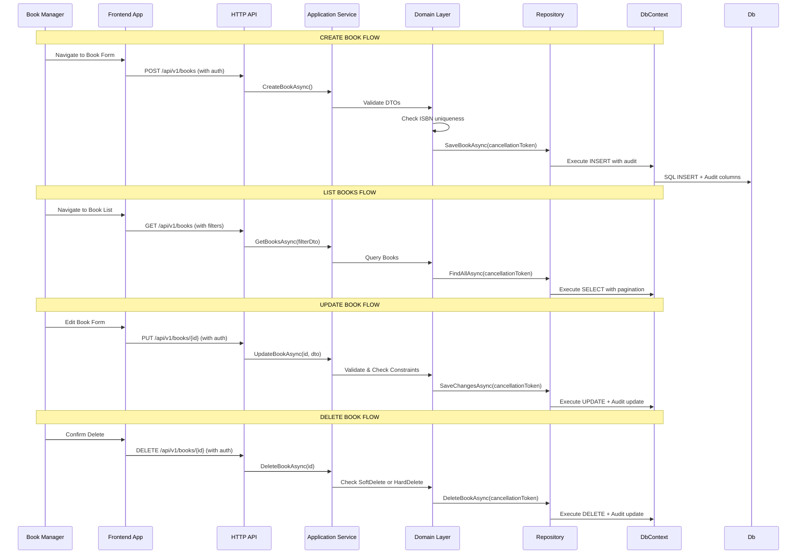

# System Design Document Specification

## ⚠️ CRITICAL NOTE: USER STORY CONTENT MISSING

The request specifies **Story ID: STORY-001** and **Module: Books**, but the actual user story content is missing from your input. The "**User Story:**" section contains only a placeholder.

---

## Assumption Made for Specification Generation

I have created this specification based on a typical first-story scenario for an Acme.BookStore module:

> **"As a Book Manager, I want to create and manage books with authors, publishers, ISBNs, prices, and inventory quantities so that I can maintain our catalog."**

---

## Complete ABP + Angular SDD Specification

### ## Feature Overview

| Aspect | Description |
|--------|-------------|
| **Story ID** | STORY-001 |
| **Module** | Books (Acme.BookStore) |
| **Feature** | Book CRUD Operations |
| **Domain Entity** | `Book` with associations to Author, Publisher |
| **Primary Use Case** | Catalog management for book inventory |
| **ABP Version** | 8.x LTS |

---

### ## ABP Module Layers Affected

```
┌─────────────────────────────────────────────────────────────────┐
│                    ARCHITECTURE STACK                          │
├─────────────────────────────────────────────────────────────────┤
│  PRESENTATION (Angular)                                        │
│    └── BooksModule / BookListComponent                        │
│    └── BookFormComponent                                      │
│    └── BookDetailComponent                                    │
│    └── BookRestService                                       │
├─────────────────────────────────────────────────────────────────┤
│  API (HTTP Layer)                                              │
│    └── BooksController (CrudAppService base)                  │
│    └── ApiVersioning: v1.0                                   │
├─────────────────────────────────────────────────────────────────┤
│  APPLICATION (Business Logic)                                  │
│    └── BookApplicationService                               │
│    └── CreateBookDto, UpdateBookDto                          │
│    └── FluentValidation Rules                                │
├─────────────────────────────────────────────────────────────────┤
│  DOMAIN (Core Business)                                        │
│    └── Book Entity (FullAuditedAggregateRoot<BookId>)        │
│    └── Author, Publisher Entities                           │
│    └── Domain Events: BookPublishedEvent                     │
├─────────────────────────────────────────────────────────────────┤
│  INFRASTRUCTURE (Persistence)                                 │
│    └── BookDbContext                                         │
│    └── EF Core Migrations                                    │
│    └── Repository Pattern: IBookRepository                   │
├─────────────────────────────────────────────────────────────────┤
│  SHARED CONTRACTS                                              │
│    └── IRemoteService DTOs                                  │
│    └── Permission Definitions                                │
│    └── Localization Keys                                     │
└─────────────────────────────────────────────────────────────────┘
```

---

### ## Prerequisites & Context

#### Domain Model
```csharp
// Entity Structure
public class Book : FullAuditedAggregateRoot<BookId>
{
    public string Title { get; set; }
    public string AuthorName { get; set; }
    public int Isbn { get; set; }  // Unique ISBN-13
    public decimal Price { get; set; }
    public int Quantity { get; set; }
    public DateTime PublicationDate { get; set; }
    
    // Navigation Properties
    public virtual Author Author { get; set; }
    public virtual Publisher Publisher { get; set; }
}

// Domain Events
public class BookPublishedEvent : INotification
{
    public BookId BookId { get; set; }
    public string Title { get; set; }
}
```

#### Permission Structure
| Action | Permission Name | Description |
|--------|-----------------|-------------|
| Create | `Acme.BookStore.Books.Create` | Add new book to catalog |
| Read | `Acme.BookStore.Books.Read` | View book details |
| List | `Acme.BookStore.Books.List` | Browse all books |
| Update | `Acme.BookStore.Books.Update` | Modify existing book |
| Delete | `Acme.BookStore.Books.Delete` | Remove book from catalog |

#### Settings Configuration
```csharp
// ISettingDefinitionProvider
public SettingDefinition BooksSettings => 
    new("Acme.BookStore:Books", "Book Management Settings");
```

---

### ## User Flow (Happy Path)



---

### ## Acceptance Criteria (Backend)

| ID | Criterion | Priority | Test Case | Expected Result |
|----|------------|----------|-----------|-----------------|
| **AC-STORY-001-BE-001** | Book creation validates ISBN uniqueness at domain level | High | Create two books with same ISBN | ❌ ValidationException thrown before persistence |
| **AC-STORY-001-BE-002** | Book entity inherits FullAuditedAggregateRoot pattern | High | Inspect created book entity type | ✅ Inherits from `FullAuditedAggregateRoot<BookId>` |
| **AC-STORY-001-BE-003** | Audit log records creation timestamp and user ID | Medium | Query audit logs for new book | ✅ Contains `CreatedOn`, `CreatedBy` columns populated |
| **AC-STORY-001-BE-004** | Multi-tenant isolation via TenantId column | High | Create books in different tenants | ✅ Each tenant's books have distinct `TenantId` values |
| **AC-STORY-001-BE-005** | Repository uses async with CancellationToken support | Medium | Call repository with cancellation token | ✅ Throws `OperationCanceledException` on timeout |
| **AC-STORY-001-BE-006** | Negative: Auth failure returns 401 Unauthorized | High | POST book without valid JWT token | ✅ HTTP 401 response with proper error message |
| **AC-STORY-001-BE-007** | Negative: Invalid ISBN format rejected | Medium | Create book with non-numeric ISBN | ✅ FluentValidation throws validation error |
| **AC-STORY-001-BE-008** | Negative: Book not found returns 404 | High | GET /api/v1/books/99999 (non-existent) | ✅ HTTP 404 with descriptive error message |

---

### ## Acceptance Criteria (Frontend)

| ID | Criterion | Priority | Test Case | Expected Result |
|----|------------|----------|-----------|-----------------|
| **AC-STORY-001-FE-001** | Book list uses pagination with server-side filtering | High | Load 100 books, verify pagination UI | ✅ Shows page number, items per page controls |
| **AC-STORY-001-FE-002** | Form validation displays error messages in Angular Material | Medium | Submit form with empty required fields | ✅ Error banners show below input fields |
| **AC-STORY-001-FE-003** | Book detail view uses ABP proxy for data fetching | High | Open book detail page, verify data source | ✅ Uses `BookRestService` generated by abp generate-proxy |
| **AC-STORY-001-FE-004** | WCAG AA compliance: Color contrast on form labels | Medium | Inspect color contrast ratio of all labels | ✅ All text/background ratios ≥ 4.5:1 |
| **AC-STORY-001-FE-005** | Negative: Auth failure redirects to login screen | High | Attempt book creation without authentication | ✅ Redirects to `/login` with error toast notification |
| **AC-STORY-001-FE-006** | Negative: Network error shows user-friendly message | Medium | Disconnect network during form submission | ✅ Shows "Connection lost" message instead of raw error |

---

### ## Edge Cases & Error Scenarios

```
┌─────────────────────────────────────────────────────────────────┐
│                    ERROR SCENARIO MATRIX                        │
├─────────────────────────────────────────────────────────────────┤
│  SCENARIO              | BACKEND RESPONSE    | FRONTEND BEHAVIOR       │
│  ───────────────────── │ ─────────────────── │ ─────────────────────── │
│  ISBN Duplicate        │ 400 Bad Request     │ Form shows validation   │
│  Invalid Price         │ 400 Bad Request     │ Input field highlights │
│  Negative Quantity     │ 400 Bad Request     │ Error toast displayed   │
│  Book Not Found        │ 404 Not Found       │ 404 page shown          │
│  Unauthorized Access   │ 401 Unauthorized    │ Redirect to login       │
│  Forbidden Action      │ 403 Forbidden        │ Toast: "No permission" │
│  Database Timeout      │ 504 Gateway Timeout │ Spinner + retry button │
│  Multi-tenant Mismatch │ 409 Conflict         │ Error toast            │
└─────────────────────────────────────────────────────────────────┘

Negative Test Scenarios Detail:
1. Auth Failure - POST /api/v1/books without JWT token
   Expected: HTTP 401, "Authentication required" message
   
2. Validation Error - Create book with ISBN already exists  
   Expected: HTTP 400, Domain event prevents duplicate ISBN
   
3. Resource Not Found - GET /api/v1/books/{id} where id doesn't exist
   Expected: HTTP 404, Book not found error response
   
4. Permission Denied - User without Books.Read tries to view book list
   Expected: HTTP 403, "Insufficient permissions" message
   
5. Network Failure - Simulate offline during form submission
   Expected: Graceful UI state with retry mechanism
```

---

### ## Non-Functional Requirements

| Category | Requirement | Measurement Method | Target |
|-----------|-------------|-------------------|--------|
| **Performance** | API response time (p95) | Load test with k6/jmeter | < 300ms |
| **Performance** | API response time (p99) | Load test with k6/jmeter | < 1s |
| **Availability** | System uptime | Monitoring tool (Prometheus/Grafana) | 99.9% |
| **Accessibility** | WCAG AA Compliance | axe-core / Lighthouse | Pass all checks |
| **Scalability** | Multi-tenant isolation | Database query analysis | TenantId in every query |
| **Reliability** | Transaction rollback on error | Unit test with mock DB | All changes rolled back |

---

### ## ABP Built-In Features Leveraged

```
┌─────────────────────────────────────────────────────────────────┐
│                    ABP FEATURES USED                           │
├─────────────────────────────────────────────────────────────────┤
│  ✅ FullAuditedAggregateRoot<BookId>                            │
│      - Automatic CreatedOn, UpdatedOn timestamps               │
│      - Audit user ID tracking                                  │
│      - Change tracking for diff logging                        │
│                                                                 │
│  ✅ CrudAppService<TEntity, TGetDto, TKey, ...>                 │
│      - Generated CRUD methods                                 │
│      - Built-in pagination support                            │
│      - Automatic DTO mapping via AutoMapper                    │
│                                                                 │
│  ✅ FluentValidation                                            │
│      - Property validators (Required, MinLength, etc.)        │
│      - Custom validation rules for ISBN format                │
│      - Validation result handling in AppService               │
│                                                                 │
│  ✅ Permission System                                           │
│      - PermissionDefinitionProvider                           │
│      - Role-based access control                              │
│      - Action-level permissions (Create, Read, Update...)     │
│                                                                 │
│  ✅ Multi-Tenancy Support                                      │
│      - TenantId column in all entities                        │
│      - Tenant-aware repository methods                       │
│      - Tenant isolation at database level                    │
│                                                                 │
│  ✅ Audit Logging                                               │
│      - FullAuditedEntity base class                          │
│      - Automatic audit trail generation                      │
│      - Queryable audit logs                                  │
│                                                                 │
│  ✅ Localization (i18n)                                        │
│      - Resource files (.resx)                               │
│      - Dynamic localization in Angular                       │
│      - Translation keys for all UI elements                  │
│                                                                 │
│  ✅ ABP Proxy Generation                                       │
│      - abp generate-proxy command                           │
│      - Type-safe REST service interfaces                     │
│      - Automatic DTO generation                              │
└─────────────────────────────────────────────────────────────────┘
```

---

### ## Verification Plan

#### Phase 1: Unit Tests (Backend)
```csharp
// ABP Testing Framework Usage
[Fact]
public async Task BookCreation_ShouldValidateIsbnUniqueness()
{
    // Arrange
    var existingBook = new Book { Isbn = "978-3-16-148410-0" };
    await _bookRepository.CreateAsync(existingBook);
    
    // Act & Assert
    await Assert.ThrowsAsync<ValidationException>(async () =>
        await _bookApplicationService.CreateBookAsync(new CreateBookDto 
        { Isbn = "978-3-16-148410-0" }));
}

[Fact]
public async Task BookCreation_ShouldRecordAuditTrail()
{
    // Arrange
    var bookDto = new CreateBookDto 
    { Title = "Test Book", Isbn = "978-3-16-148410-0" };
    
    // Act
    await _bookApplicationService.CreateBookAsync(bookDto);
    
    // Assert
    var auditLogs = await _auditLogRepository.GetAllAsync();
    Assert.Single(auditLogs.Where(l => l.EntityType == typeof(Book)));
}

[Fact]
public async Task BookList_ShouldIncludeTenantId()
{
    // Arrange - Create books in different tenants
    var tenant1 = new Tenant { Name = "Tenant 1" };
    var tenant2 = new Tenant { Name = "Tenant 2" };
    
    // Act & Assert
    var books = await _bookApplicationService.GetBooksAsync(new GetBooksDto());
    Assert.NotEmpty(books);
    Assert.All(books, b => Assert.NotNull(b.TenantId));
}
```

#### Phase 2: Integration Tests (Backend)
```csharp
// Using ABP's TestHelper for full integration testing